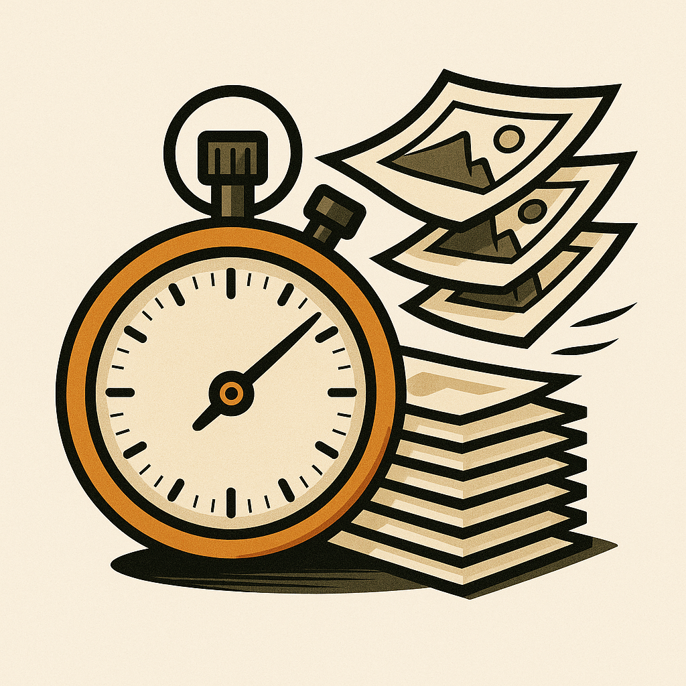

# FrameMeter

<div align="center">
  
  
  **A visual frame rate and timing visualization app for iOS and macOS**
  
  [](https://swift.org)
  [](https://developer.apple.com/swiftui/)
  [](https://developer.apple.com)
</div>

## Overview

FrameMeter is a sophisticated stopwatch and chronometer app that visualizes timing progress through frame-based indicators. Operating at 24 FPS (matching standard film frame rates), it provides precise timing measurements with intuitive visual feedback through colored progress bars.

## Features

### 🎬 Frame-Based Timing
- **24 FPS Operation**: Precise timing at 24 frames per second (≈41.67ms intervals)
- **Dual-Level Progress**: Track both individual frames (0-24) and cycles (up to 12)
- **288 Total Frames**: Maximum timing capacity of 12 seconds

### 📊 Visual Progress Indicators
- **Two-Column Layout**: Separate visual bars for frames and cycles
- **Color-Coded Progress**: Blue bars for completed progress, gray for remaining
- **Real-Time Updates**: Smooth, responsive visual feedback
- **Dynamic Sizing**: Responsive design that adapts to screen size

### ⏱️ Chronometer Controls
- **Start/Stop**: Precise timing control
- **Reset Function**: Return to initial state
- **Live Counter**: Real-time display of current cycle and frame numbers

## Technical Details

### Architecture
- **Language**: Swift with SwiftUI framework
- **Pattern**: MVVM architecture with `@Observable` state management
- **Timing Engine**: `Timer.scheduledTimer` with precise frame intervals
- **UI Framework**: SwiftUI with `GeometryReader` for responsive design

### Project Structure
```
FrameMeter/
├── FrameMeter.xcodeproj/          # Xcode project configuration
├── FrameMeter/                    # Main source directory
│   ├── FrameMeterApp.swift       # App entry point (@main)
│   ├── ContentView.swift         # Main UI with visual bars and controls
│   ├── Chronometer.swift         # Core timing logic and state management
│   ├── Assets.xcassets/          # App icons and visual assets
│   └── Preview Content/          # SwiftUI preview assets
└── static/
    └── logo.png                  # App logo (1024x1024)
```

### Key Components

#### Chronometer Class
- **Observable State**: Reactive updates using SwiftUI's `@Observable`
- **Timer Management**: Precise 24 FPS timing control
- **State Tracking**: Frame count, cycle count, and running status

#### ContentView
- **Visual Bars**: Dynamic progress indicators using `RoundedRectangle`
- **Responsive Layout**: Adapts to different screen sizes
- **Control Interface**: Start/Stop and Reset buttons

## Use Cases

Perfect for:
- 🎥 **Film/Video Production**: Frame-accurate timing for shoots
- 🎨 **Animation Work**: Precise frame counting and timing
- 📚 **Education**: Understanding frame rates and timing concepts
- ⏰ **Creative Workflows**: Any timing-sensitive creative process

## Requirements

- **iOS**: 14.0+ or **macOS**: 11.0+
- **Xcode**: 12.0+ for development
- **Swift**: 5.0+

## Installation

1. Clone the repository:
   ```bash
   git clone https://github.com/jmg-duarte/FrameMeter.git
   ```

2. Open the project in Xcode:
   ```bash
   cd FrameMeter
   open FrameMeter.xcodeproj
   ```

3. Build and run the project using Xcode's build system

## Usage

1. **Start Timing**: Tap the "Start" button to begin frame counting
2. **Monitor Progress**: Watch the visual bars fill as frames and cycles progress
3. **Check Counter**: View the current cycle and frame numbers in real-time
4. **Stop/Resume**: Use the "Stop" button to pause timing
5. **Reset**: Use the "Reset" button to return to the initial state

## Development

### Building from Source
```bash
# Open in Xcode
open FrameMeter.xcodeproj

# Or use xcodebuild from command line
xcodebuild -project FrameMeter.xcodeproj -scheme FrameMeter build
```

### Contributing
1. Fork the repository
2. Create your feature branch (`git checkout -b feature/AmazingFeature`)
3. Commit your changes (`git commit -m 'Add some AmazingFeature'`)
4. Push to the branch (`git push origin feature/AmazingFeature`)
5. Open a Pull Request

## License

This project is available under the MIT License. See the LICENSE file for more details.

## Author

**jmg-duarte** - [GitHub Profile](https://github.com/jmg-duarte)